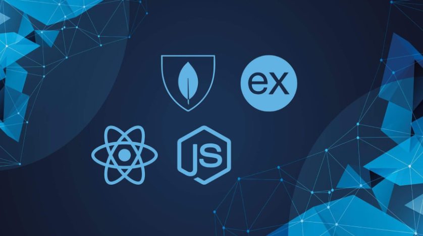

<h1 align="center">Namaskaram  I'm <b>Siddharth Joisar</b></h1>

 
    
     
     
<h1 align="center">💻 A Passionate MERN Stack Developer</h1>

    

 
<h1 align="center">🙋‍♂️ About Me</h1>

    

        👨‍💻 My foremost passion is web development, where I specialize in crafting stunning websites.
         
        🔦 Beyond the Web, my interest lies in Data Science and Machine Learning
         
        🔆 I'm proficient in Data Structures and Algorithms using C++
         
        🔭 I’m currently working on the Edtech Project.
         
        🌱 I’m currently learning ML Algorithms.
         
        👯 I’m looking to collaborate on Hackathons, Full Stack Projects.
         
        🚀 I am committed to continuously expanding my knowledge and skills, and staying updated with industry trends
        and best practices.
    

 

    <h1 align="center">🔧 Languages & Tools</h1>
    
    
    
    
    
    
    
    
    
    
    
    
    
    
    
    
    
    
    
    
    
    
    
    
    
    
    
    
    

 

<h1 align="center">📊 My GitHub Stats</h1>

    
     
     
    
     
     
    
         
         
    
 

 

<h1>🌐 Connect with me:</h1>

    
    
    
